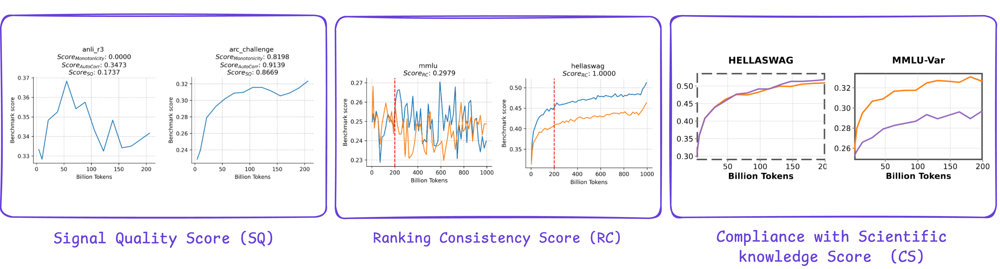

## Evaluation Metric

### How do we evaluate participants submissions?

We propose to evaluate submitted solutions based on three main criteria, which will be combined into a global score used for the final ranking: signal quality (SQ), ranking consistency (RC) and compliance to scientific knowledge domains (CS). In addition, a compliance check will be applied to all submissions to ensure alignment with the scientific knowledge domains (see Appendix E on the proposal paper).

The overall score is computed as a weighted sum:

Participants will be able to compute the signal quality subscore locally using the provided model checkpoints (ranging from 0 to 200 BT) along with the accompanying scoring algorithm (provided in a notebook the starting kit). In contrast, the other two subscores cannot be computed independently, as the corresponding checkpoints—from 200 GT to 1 T tokens, as well as the 0.5 billion parameter model trained exclusively on web data—will remain hidden throughout the competition. The global score will, however, be automatically computed upon submission via the  hugging face competition space, enabling participants to monitor their overall performance. This setup is designed to prevent overly customized solutions tailored specifically to the released checkpoints.

 

For more details, please refer to **Metrics** section of the [Competition Proposal Paper](https://arxiv.org/abs/2506.07731)