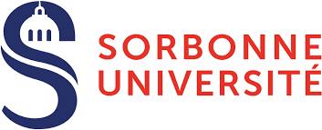
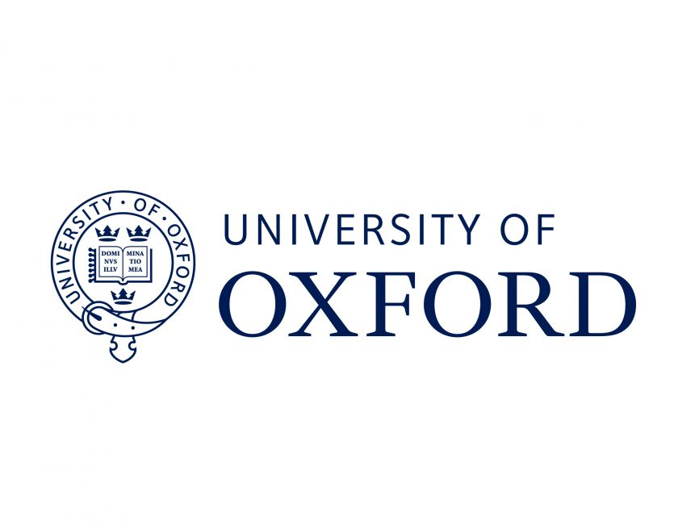

 

From Noise to Knowledge: Rethinking Benchmarks for the Early Training of LLMs

Join us in building  benchmarks that capture early-stage reasoning & Scientific Knowledge in LLMs

  <h2> Register on Codabench to Participate </h2>
  
You can register <a href="https://www.codabench.org/competitions/9118/" style="color: #007BFF;">here</a> 

  
You can join the discussion channel <a href="https://discord.gg/fcYeR8bn" style="color: #007BFF;">here</a> 

  
You can find more details in the <a href="https://arxiv.org/abs/2506.07731" style="color: #007BFF;">Competition Proposal Paper</a> 

## Competition Overview

The development of Large Language Models (LLMs) typically begins with a series of ablation experiments, wherein various model architectures, data mixtures, and training hyperparameters are systematically evaluated. This phase is commonly referred to as the early stages of training. During this period, researchers primarily monitor two key metrics: the training loss curve and evaluation scores. However, existing evaluation benchmarks often fail to provide meaningful or discriminative signals during these initial stages where LLMs are trained on a few tokens ~300B tokens, making it challenging to derive conclusive insights from ongoing experiments.

This competition tackles the challenge of designing scientific knowledge evaluation tasks specifically tailored for measuring early training progress of language models. Participants are invited to develop novel evaluation methodologies or adapt existing benchmarks to better capture performance differences among language models. To support this effort, we provide three pre-trained small models (0.5B, 1B, and 3B parameters), along with intermediate checkpoints sampled during training up to 200B tokens. All experiments and development work can be run on widely available free cloud-based GPU platforms, making participation accessible to researchers with modest hardware. Submissions will be evaluated based on three criteria: the quality of the performance signal they produce, the consistency of model rankings at 1 trillion tokens of training, and their alignment with the scientific knowledge domain. By promoting the design of tailored evaluation strategies for SLMs, this competition aims to attract a broad range of participants from around the world, including those who may not be machine learning experts or have access to dedicated GPU resources. Ultimately, this initiative seeks to make foundational LLM research more systematic and benchmark-informed from the earliest phases of model development.

## Anouncements

- **26/05/2025**: Competition proposal accepted at NeurIPS 2025!
- **07/07/2025**: E2ML Competition Kick-off 

## Competition Timeline
<table class="foo" style="border-collapse: collapse; width: 100%;">
    <tr style="border-bottom: 1px solid #ddd;">
        <td width="50%" style="padding: 12px;"><b> Competition Period</b></td>
        <td width="50%" style="padding: 12px;">07 July 2025 - 04 November 2025</td>
    </tr>
    <tr style="border-bottom: 1px solid #ddd;">
        <td width="50%" style="padding: 12px;"><b> Warm-up Phase</b></td>
        <td width="50%" style="padding: 12px;">07 July 2025 - 11 August 2025 (5 weeks)</td>
    </tr>
    <tr style="border-bottom: 1px solid #ddd;">
        <td width="50%" style="padding: 12px;"><b> Development Phase</b></td>
        <td width="50%" style="padding: 12px;">11 August 2025 - 20 October 2025 (10 weeks)</td>
    </tr>
    <tr style="border-bottom: 1px solid #ddd;">
        <td width="50%" style="padding: 12px;"><b> Final Phase</b></td>
        <td width="50%" style="padding: 12px;">20 October 2025 - 03 November 2025 (3 weeks)</td>
    </tr>
    <tr style="border-bottom: 1px solid #ddd;">
        <td width="50%" style="padding: 12px;"><b> Results Announcement</b></td>
        <td width="50%" style="padding: 12px;">04 November 2025</td>
    </tr>
    <tr style="border-bottom: 1px solid #ddd;">
        <td width="50%" style="padding: 12px;"><b> Winners' Fact Sheets & Code Release Due</b></td>
        <td width="50%" style="padding: 12px;">22 November 2025</td>
    </tr>
    <tr style="border-bottom: 1px solid #ddd;">
        <td width="50%" style="padding: 12px;"><b> NeurIPS Competition Workshop Presentation</b></td>
        <td width="50%" style="padding: 12px;">6 or 7 December 2025</td>
    </tr>
</table>

## Prizes

- 🥇 **1st Place**: 6,000 USD
- 🥈 **2nd Place**: 4,000 USD
- 🥉 **3rd Place**: 2,000 USD

A public leaderboard showcasing the top evaluation tasks across a diverse set of LLMs will be maintained. 

## Special prizes

- 🎓 **Student Awards**: 2x 2,000 USD for the top 2 solutions submitted by participants justifying a student status

## Organizers

- Mouadh Yagoubi, <i>Technology Innovation Institute</i>
- Yasser Dahou, <i>Technology Innovation Institute</i>
- Billel Mokeddem, <i>Technology Innovation Institute</i>
- Younes Belkada, <i>Technology Innovation Institute</i>
- Phuc H. Le-Khac, <i>Technology Innovation Institute</i>
- Basma El Amel Boussaha, <i>Technology Innovation Institute</i>
- Reda Alami, <i>Technology Innovation Institute</i>
- Jingwei Zuo, <i>Technology Innovation Institute</i>
- Damiano Marsili, <i>California Institute of Technology</i>
- Mugariya Farooq, <i>Technology Innovation Institute</i>
- Mounia Lalmas, <i>Spotify UK</i>
- Georgia Gkioxari, <i>California Institute of Technology</i>
- Patrick Gallinari, <i>Sorbonne University</i>
- Philip Torr, <i>Oxford University</i>
- Hakim Hacid, <i>Technology Innovation Institute</i>

## Affiliated Institutions

<table cellspacing="40" cellpadding="0" style="border-collapse: collapse; margin: 0 auto; width: 100%;">
    <tr>
        <td style="text-align: center; border: none; width: 20%;">
            

                
            

        </td>
        <td style="text-align: center; border: none; width: 20%;">
            

                
            

        </td>
        <td style="text-align: center; border: none; width: 20%;">
            

                
            

        </td>
        <td style="text-align: center; border: none; width: 20%;">
            

                
            

        </td>
        <td style="text-align: center; border: none; width: 20%;">
            

                
            

        </td>
    </tr>
</table>

